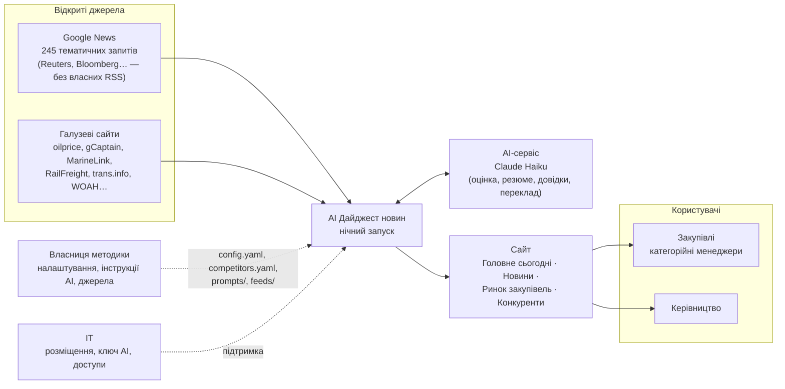
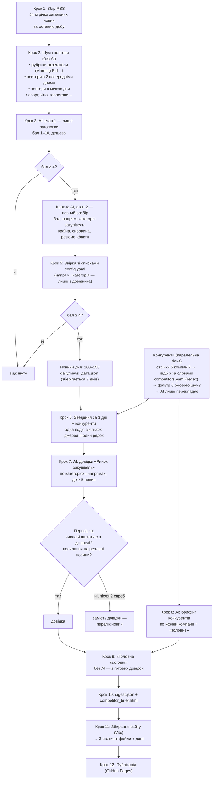
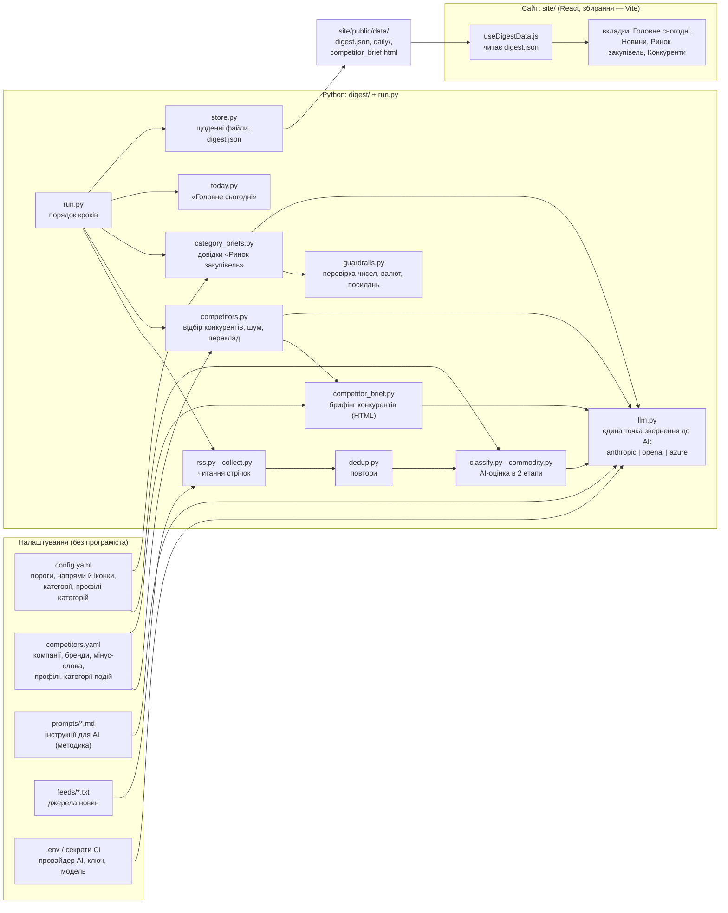
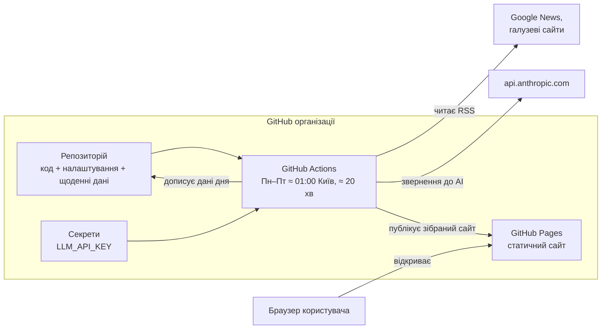
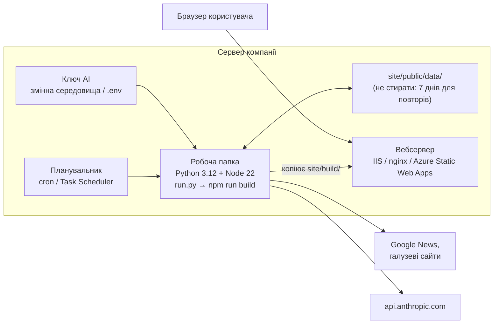
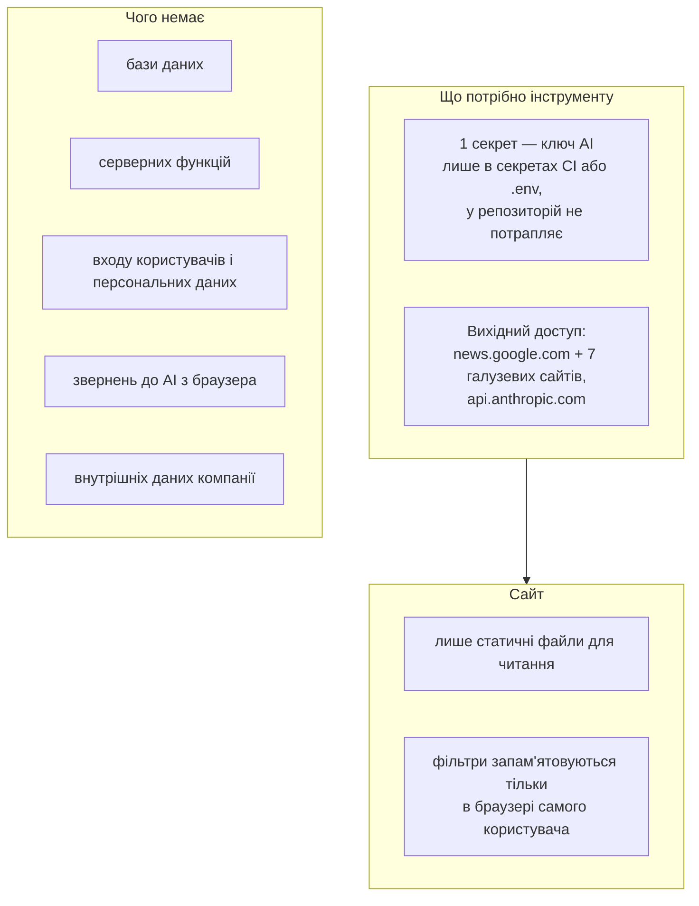
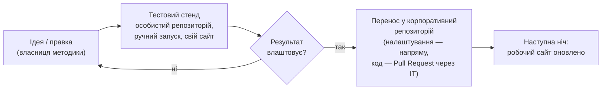

# AI Дайджест новин — архітектура рішення в 5 розрізах

Діаграми записані у форматі Mermaid: GitHub показує їх як картинки прямо в цьому файлі.

| № | Розріз | На яке питання відповідає |
|---|---|---|
| 1 | [Бізнес-контекст](#1-бізнес-контекст) | Хто користується, звідки дані, що отримує бізнес |
| 2 | [Процес (нічний конвеєр)](#2-процес-нічний-конвеєр) | Що відбувається з новиною від джерела до сайту |
| 3 | [Компоненти](#3-компоненти) | З яких частин складається код і налаштування |
| 4 | [Розгортання](#4-розгортання) | Де це працює: варіант A (GitHub) і варіант B (свій сервер) |
| 5 | [Безпека, доступи і зміни](#5-безпека-доступи-і-зміни) | Секрети, мережа, ролі, як зміна потрапляє в робочу версію |

---

## 1. Бізнес-контекст

Інструмент щоночі перетворює сотні зовнішніх новин на коротку ситуативну картину для закупівель: що змінилося на ринках сировини, у логістиці, санкціях, погоді та у світових конкурентів. Внутрішні дані компанії не використовуються.

**Межі рішення.** Тільки зовнішня ситуативна інформація, тільки читання. Немає внутрішніх даних, рекомендацій «що робити», обліку користувачів, бази даних і серверної частини.

---

## 2. Процес (нічний конвеєр)

Одна команда `python run.py`, далі збирання сайту. Цифри — типовий день (одна доба збору).

Деталі «чому саме так» — у [1-biznes-logika.md](1-biznes-logika.md).

---

## 3. Компоненти

| Частина | Обсяг | Хто змінює |
|---|---|---|
| Налаштування (`config.yaml`, `competitors.yaml`, `prompts/`, `feeds/`) | ≈ 1 450 рядків тексту (з них ≈ 640 — списки джерел) | власниця методики |
| Python (`run.py`, `digest/`) | ≈ 2 000 рядків | ІТ, через Pull Request |
| Сайт (`site/src/`) | ≈ 2 300 рядків (з оформленням) | ІТ, через Pull Request |
| Перевірки (`tests/`, `site/src/App.test.jsx`) | 13 автотестів | ІТ |

Формат `digest.json` (договір між нічним запуском і сайтом) описаний у [README](../README.md#файл-даних-сайту-digestjson).

---

## 4. Розгортання

### Варіант A — корпоративний GitHub (рекомендовано)

Серверів немає: запуск іде на машинах GitHub, сайт — на GitHub Pages.

### Варіант B — власний сервер

---

## 5. Безпека, доступи і зміни

### Секрети, мережа, дані

Залежності: 0 відомих вразливостей (`npm audit`, `pip-audit`, жовтень 2026). Модулі нічного запуску — лише офіційні `actions/*`.

### Ролі

| Роль | Що робить | Доступ |
|---|---|---|
| Власниця методики (закупівлі) | інструкції для AI, налаштування, джерела, конкуренти | *Write* у репозиторії |
| ІТ | розміщення, ключ AI, доступи, оновлення бібліотек, зміни коду | *Admin* |
| Користувачі | читають сайт | лише адреса сайту |

### Як зміна потрапляє в робочу версію

Зміни йдуть тільки в один бік: тестовий стенд → корпоративна версія.
